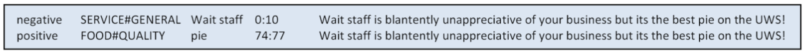

<p align="center">
  <a href="" rel="noopener">
 </a>
</p>

<h3 align="center">NLP Sentiment Analysis Project</h3>

<div align="center">

[]()
[](/LICENSE)

</div>

Charles Boy de la Tour - Gabriel Drai - Zakariae El Asri

---

<p align="left"> The goal of this exercise is to implement a classifier to predict aspect-based polarities of opinions in
sentences.

</p>

## 📝 Table of Contents

- [About](#about)
- [Getting Started](#getting_started)
- [Deployment](#deployment)
- [Usage](#usage)
- [Built Using](#built_using)
- [TODO](../TODO.md)
- [Contributing](../CONTRIBUTING.md)
- [Authors](#authors)
- [Acknowledgments](#acknowledgement)

## About

The goal of this exercise is to implement a classifier to predict aspect-based polarities of opinions in sentences.

The classifier assigns a polarity label to every triple:

- aspect_category,
- aspect_term,
- sentence.

The polarity labels are: **positive**, **negative** and **neutral.**



## Implementation

Our implementation is based on the pre-trained language models [BERT](https://arxiv.org/abs/1810.04805), developed by Google in 2018. We use this model from [Hugging Face](https://huggingface.co/) 🤗. BERT is a language representation model based on transformers.

### Data Processing

The input to our model is the concatenation of the aspect_category, the aspect_term and the sentence separated by the "SEP" token

```
Give examples
```

### Results

The devs accuracy for 5 runs are:

| 1     | 2     | 3     | 4     |   5   |
| ----- | ----- | ----- | ----- | :---: |
| 84.57 | 85.64 | 83.24 | 84.57 | 85.64 |

## 🔧 Running the tests

Explain how to run the automated tests for this system.

### Break down into end to end tests

Explain what these tests test and why

```
Give an example
```

### And coding style tests

Explain what these tests test and why

```
Give an example
```

## ✍️ Authors

- [@CharlesBoydelaTour](https://github.com/CharlesBoydelaTour)
- [@Gabrielchapo](https://github.com/Gabrielchapo)
- [@elasriz](https://github.com/elasriz)

## 🎉 Acknowledgements

- Devlin, Jacob, et al. "Bert: Pre-training of deep bidirectional transformers for language understanding." *arXiv preprint arXiv:1810.04805* (2018).
